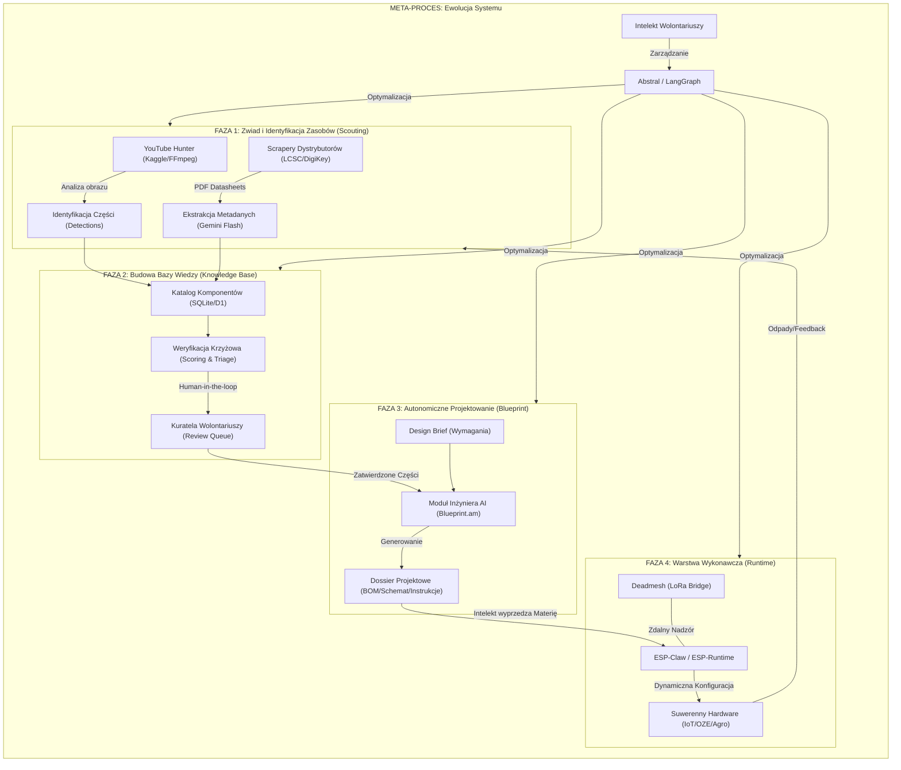

# Łańcuch Automatyzacji AI: Straż Przyszłości

Niniejszy graf przedstawia architekturę przepływu wartości w ramach organizacji „Straż Przyszłości”. Obrazuje on proces transformacji surowych zasobów i danych w gotowe, suwerenne rozwiązania technologiczne.

## Graf Procesu (Mermaid)

## Opis Poszczególnych Ogniw

### 1. Zwiad (Scouting)
Fundamentem jest pozyskiwanie danych. AI analizuje materiały wideo (Hunter) oraz dokumentację techniczną (PDF), aby zrozumieć, jakie zasoby są dostępne „w śmieciach” i jakie mają parametry.

### 2. Wiedza (Knowledge)
Surowe dane są filtrowane i weryfikowane. Tutaj następuje połączenie algorytmicznej precyzji (Scoring) z ludzkim doświadczeniem (Kuratela Wolontariuszy). Wynikiem jest wiarygodny katalog komponentów.

### 3. Projektowanie (Blueprint)
W tej fazie AI przestaje być tylko analitykiem, a staje się inżynierem. Wykorzystując bazę części, tworzy kompletne dossier projektowe dla nowych urządzeń.

### 4. Wykonanie (Runtime)
Warstwa fizyczna. Dzięki frameworkom takim jak `ESP-Claw`, zaprojektowany hardware jest ożywiany i rekonfigurowany dynamicznie. `Deadmesh` zapewnia, że nadzór nad procesem trwa nawet bez dostępu do globalnej sieci.

### 5. Ewolucja (Meta)
Cały system jest zamkniętą pętlą. Każdy sukces i błąd jest analizowany przez moduły takie jak `Abstral`, co pozwala na automatyczne ulepszanie instrukcji dla agentów i całych procesów produkcyjnych.

---
**Intelekt wyprzedza Kapitał!**
